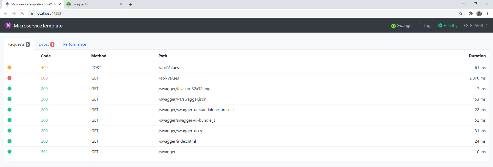
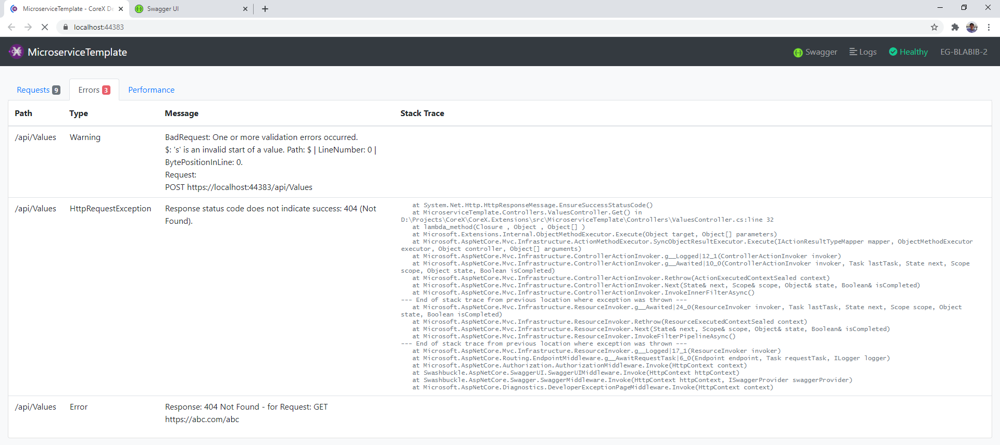
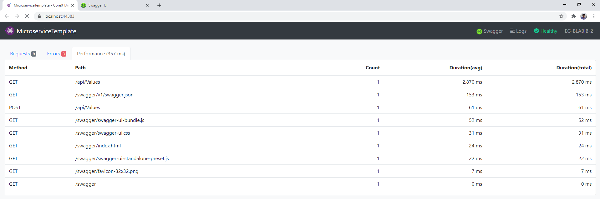
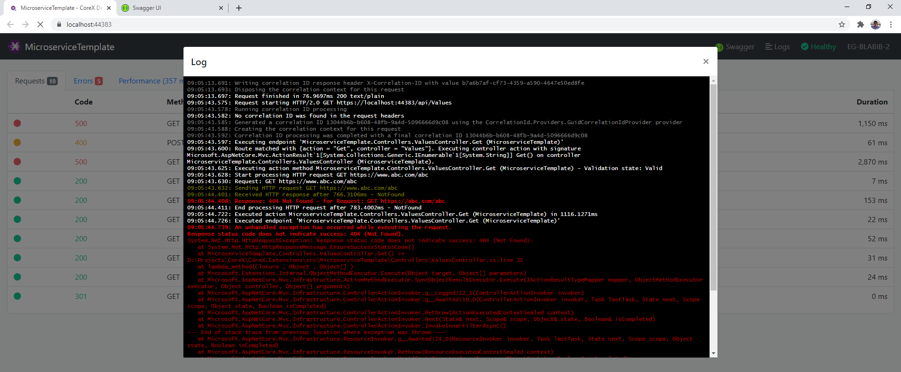

# CoreX.Extensions
This repo contains multiple extensions libraries (nuget packages):
* [CoreX.Dashboard](/src/CoreX.Dashboard) Developer Dashboard for API Metrics and Logs
* [CoreX.Extensions.Logging](/src/CoreX.Extensions.Logging) Extensions for providing quick web based logging page
* [CoreX.Extensions.Http](/src/CoreX.Extensions.Http) Extensions that facilitate logging for common http requests and exceptions
* [CoreX.Extensions.Metrics](/src/CoreX.Extensions.Metrics) Extensions to track stats for API response time and availability
* [CoreX.Microservices.Template](/src/MicroserviceTemplate) A project template for creating an awsome microservice with aspnet core









## Getting started with a new project
The fastest way is to install the Microservice project template using dotnet new command:
```
dotnet new -i CoreX.Microservices.Templates
```

Then create a directory with the name of your project:
```
mkdir MyService
cd MyService
```

Then create a new microservice!
```
dotnet new microservice
```
