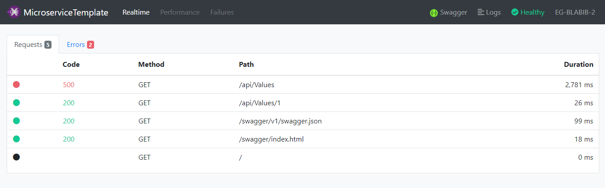
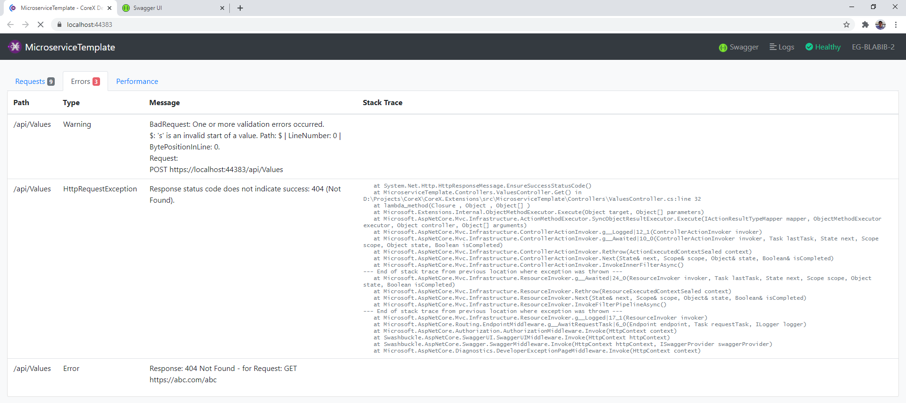

[](https://www.nuget.org/packages/CoreX.Dashboard/)

# CoreX Developer Dashboard
Add a developer dashboard to your .NET Web API that shows metrics and logs to easily monitor, debug, and troubleshoot issues with your API.





## Getting started

Add the nuget package: [](https://www.nuget.org/packages/CoreX.Dashboard/)

In startup.cs:
```
public void ConfigureServices(IServiceCollection services)
{
  services.AddMetrics();
  services.AddDeveloperDashboard();
}
```
```
public async void Configure(IApplicationBuilder app, IWebHostEnvironment env)
{
  app.UseMetrics();

  ...

  app.UseDeveloperDashboard(env);
  
  app.UseEndpoints(endpoints =>
  {
      endpoints.MapControllers();
  });
}

```
